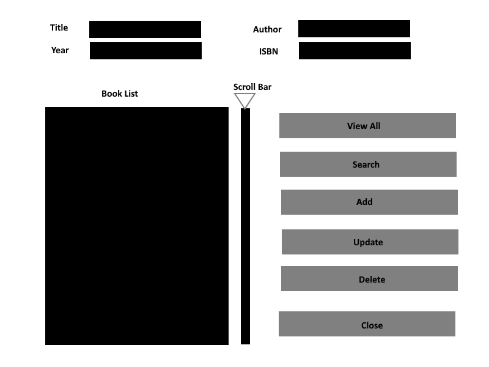

# My Book Store

My books store is just a little gui app to store some book info.  The main purpose of this project is to learn more about gui programming with python.

Here is the planed layout for the gui interface

